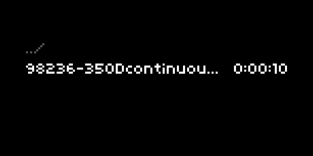

# Freesound-of-the-day

An itsybitsy *norns* thing to have the random sound of the day from Freesound for inspiration in the samples folder.

This will be a single sample in `dust/audio/freesoundoftheday`, and old ones are deleted. The filename format is *id*-*name*-by-*username*.wav.

All sounds on Freesound are free to use, and if you use these samples in your works, [make sure to credit the author](https://freesound.org/help/faq/). It's good manners and respectful toward your cybernetic comrades :)

Super thanks to everyone who is uploading sounds to Freesound. It's a treasuretrove, and hopefully can inspire norns people. Other inspirations include the and all the random parameters different synths, including norns, has for seeding creativity 🌱

# Installation

1. Install the lua library [lunajson](https://luarocks.org/modules/grafi/lunajson) with `sudo -H luarocks install lnajson`.
1. Then install this as a systemd service with `sudo -s /home/dust/code/freesoundoftheday/bin/freesoundoftheday.service /etc/systemd/system` followed by `sudo systemctl daemon-reload`.

To see how it's doing, you can run `systemctl status freesoundoftheday`. Nevermind the timestamps, norns doesn't keep an accurate clock but you can always run `date` to see what the system clock is.

# Implementation details

I hope it works 🤣.

The way this works is that this is a `systemd` service, and checks for new daily sound of the day when norns connects to network.

On Freesound the best resolution files are behind OAuth2, which I don't know how to implement in Lua. So what this does is download the higher quality MP3 preview and renders it as a wav file.
